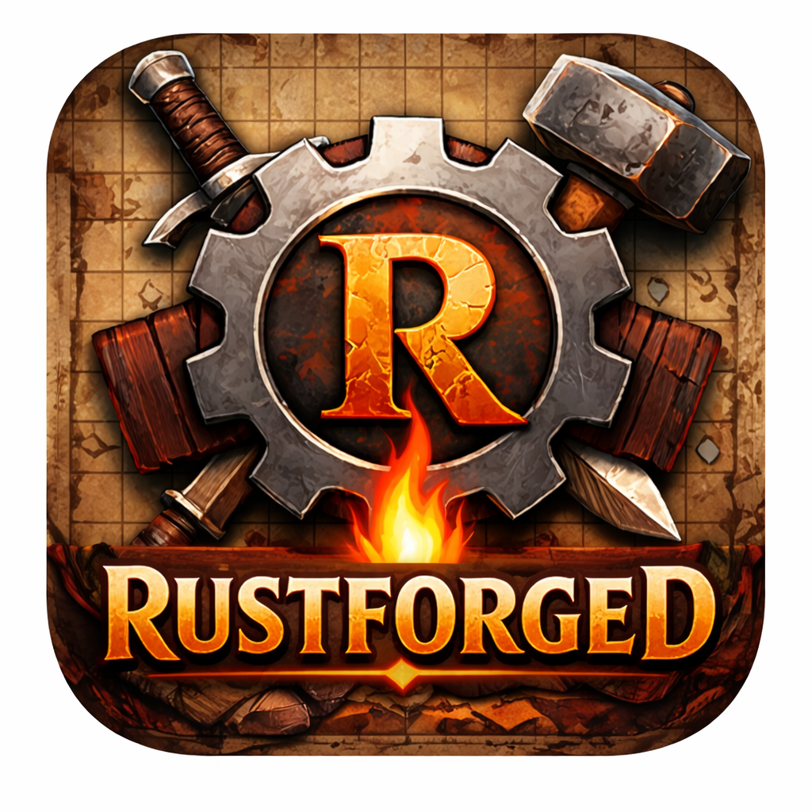

# Rustforged

<p align="center">
  
</p>

A D&D 5E Virtual Tabletop (VTT) map editor built with Bevy 0.17.3 and bevy_egui 0.38.

## Features

- **Layer-based map editing** - Background, Terrain, Doodad, Token, Annotation, and Fog of War layers
- **Asset library management** - Create, open, and organize custom asset libraries
- **Drawing tools** - Freehand drawing and straight line annotations
- **Fog of War** - Reveal/hide map areas for players
- **Grid system** - 70px grid with snap-to-grid placement (hold Shift for free placement)
- **Live session mode** - Display player view on a secondary monitor with configurable viewport
- **Map persistence** - Save and load maps as JSON files

## Downloads

Pre-built installers are available for Windows and macOS:

| Platform | Download |
|----------|----------|
| Windows (x64) | [MSI Installer](https://github.com/fitz11/rustforged/releases/latest) |
| Windows (ARM64) | [MSI Installer](https://github.com/fitz11/rustforged/releases/latest) |
| macOS (Apple Silicon) | [DMG](https://github.com/fitz11/rustforged/releases/latest) |
| Linux | Build from source (see below) |

## Quick Start

### Build from Source

```bash
# Install Rust via rustup.rs, then:
git clone https://github.com/fitz11/rustforged.git
cd rustforged
cargo run
```

**Linux dependencies:** `libasound2-dev libudev-dev pkg-config` (Debian/Ubuntu)

## Controls

### Camera

| Action | Control |
|--------|---------|
| Pan | Middle-mouse drag |
| Zoom | Scroll wheel |

### Tool Shortcuts

| Key | Tool |
|-----|------|
| V / S | Select - Click to select, drag to move |
| P | Place - Single-click asset placement |
| B | Brush - Continuous placement while dragging |
| D | Draw - Freehand annotation paths |
| L | Line - Straight line annotations |
| F | Fog - Reveal/hide fog of war areas |
| C / Shift+C | Cycle layer (Place/Brush tools) |

### Selection & Editing

| Action | Control |
|--------|---------|
| Select item | Click |
| Multi-select | Ctrl+Click or box select |
| Move selected | Drag |
| Resize selected | Drag handles |
| Fit to grid | G |
| Rotate 90° | R / Shift+R |
| Delete | Delete or Backspace |
| Copy/Cut/Paste | Ctrl+C / Ctrl+X / Ctrl+V |

### File Operations

| Action | Shortcut |
|--------|----------|
| Save | Ctrl+S |
| Save as | Ctrl+Shift+S |
| Open | Ctrl+O |
| New | Ctrl+N |
| Help | H |

## Asset Library

Assets are loaded from `assets/library/` by default with subdirectories: `unsorted/`, `terrain/`, `doodads/`, `tokens/`.

You can open or create custom asset libraries via the left panel. Maps are saved to `<library>/maps/`.

**Supported formats:** PNG, JPG, JPEG, WebP, GIF, BMP, TIFF

## Live Session Mode

1. Click "Start Session" in the toolbar
2. Select which monitor to display the player view
3. Drag the viewport indicator to frame the player view
4. Resize using corner handles (maintains aspect ratio)

The player window shows a fullscreen view without annotations or viewport indicator.

## Dependencies

| Crate | Version | Purpose |
|-------|---------|---------|
| bevy | 0.17.3 | Game engine (rendering, ECS, windowing) |
| bevy_egui | 0.38 | Immediate-mode UI integration |
| image | 0.25 | Image metadata reading |
| serde / serde_json | 1.x | JSON serialization |
| rfd | 0.15 | Native file dialogs |
| ureq | 2.x | HTTP client for update checking |
| semver | 1.x | Version parsing |
| open | 5.x | Open URLs in browser |
| futures-lite | 2.x | Async utilities |
| zip | 2.x | Archive extraction for updates |
| tracing-subscriber | 0.3 | Logging framework |
| tracing-appender | 0.2 | Log file output |
| chrono | 0.4 | Timestamps in logs |
| dirs | 6.x | Platform-specific directories |

## License

MIT OR Apache-2.0
